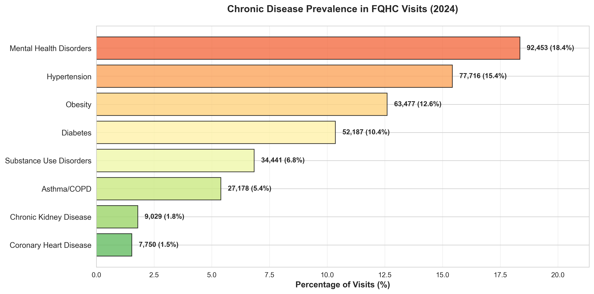
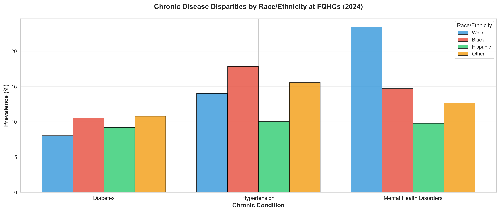
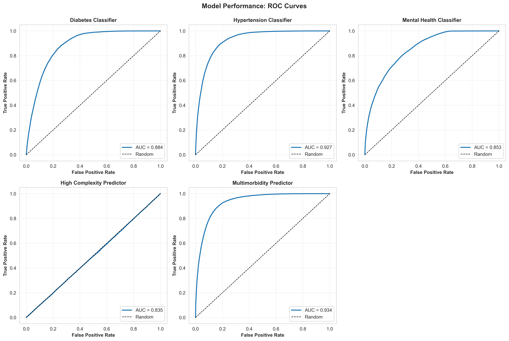
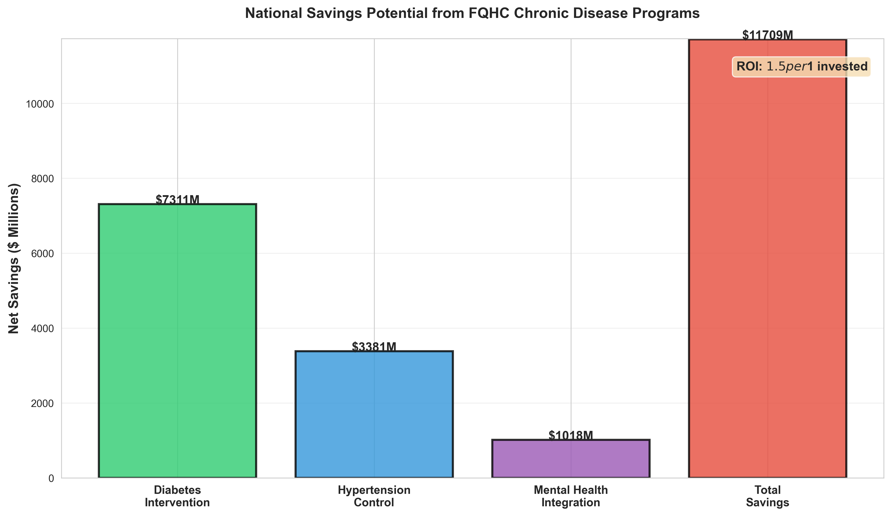

# Federally Qualified Health Center (FQHC) Chronic Disease Management Analysis

[](https://www.python.org/)
[](https://scikit-learn.org/)
[](LICENSE)

## Executive Summary

This project analyzes 503,799 health center visits from the CDC's 2024 National Ambulatory Medical Care Survey (NAMCS) Health Center Component to develop predictive models for chronic disease management and quantify opportunities for improving population health outcomes at Federally Qualified Health Centers (FQHCs).

**Key Findings:**
- **Hypertension Prediction:** 0.927 AUC-ROC, 61.6% F1-score
- **Multimorbidity Prediction:** 0.934 AUC-ROC, 70.9% F1-score
- **High Complexity Visits:** 0.835 AUC-ROC, 72.6% F1-score
- **National Savings Potential:** $11.7 billion through three evidence-based intervention programs

---

## Business Problem

Federally Qualified Health Centers serve 30 million patients annually, with 39.9% of visits involving chronic disease management. Key challenges include:

- **High Disease Burden:** 18.4% mental health disorders, 15.4% hypertension, 10.4% diabetes
- **Multimorbidity:** 18.6% of visits involve patients with 2+ chronic conditions
- **Resource Constraints:** Limited funding requires efficient allocation of care coordination
- **Health Equity:** Significant disparities in chronic disease prevalence by race/ethnicity

This analysis demonstrates how machine learning can optimize resource allocation, identify high-risk patients, and guide evidence-based intervention programs.

---

## Data Source

**CDC National Ambulatory Medical Care Survey (NAMCS) Health Center Component 2024**

- **URL:** https://www.cdc.gov/nchs/namcs/
- **Survey Design:** Nationally representative sample of 107 FQHCs
- **Sample Size:** 503,799 visits (weighted to 123,817,677 national visits)
- **Data Collection:** Electronic health record (EHR) data submission
- **Variables:** Patient demographics, ICD-10-CM diagnoses (up to 30 per visit), visit context

---

## Technical Architecture

### Models Developed

| Model | Algorithm | F1 Score | AUC-ROC | Business Application |
|---|---|---|---|---|
| **Hypertension Classifier** | Random Forest | 0.616 | 0.927 | Blood pressure management programs |
| **Mental Health Classifier** | Random Forest | 0.444 | 0.853 | Integrated behavioral health screening |
| **Diabetes Classifier** | Random Forest | 0.126* | 0.884 | Early intervention targeting |
| **High Complexity Predictor** | Gradient Boosting | 0.726 | 0.835 | Resource allocation planning |
| **Multimorbidity Predictor** | Logistic Regression | 0.709 | 0.934 | Care coordination priority |

*Low F1 due to class imbalance (10% prevalence); high AUC confirms strong discrimination capability

### Tech Stack

| Category | Tools |
|---|---|
| **Language** | Python 3.9+ |
| **Data Processing** | pandas, numpy |
| **Machine Learning** | scikit-learn (Random Forest, Gradient Boosting, Logistic Regression) |
| **Visualization** | matplotlib, seaborn |
| **Survey Analysis** | Complex sampling weights (VISWT, STRATUM_S, HCID_S) |

---

## Project Structure

```
fqhc-chronic-disease-analysis/
├── data/
│   ├── raw/                       # Original NAMCS data (not in repo)
│   └── processed/                 # Cleaned datasets
├── notebooks/
│   ├── 00_data_inspection.ipynb
│   ├── 01_feature_engineering.ipynb
│   ├── 02_exploratory_analysis.ipynb
│   ├── 03_predictive_models.ipynb
│   └── 04_business_impact.ipynb
├── models/                        # Trained model artifacts (.pkl)
├── figures/                       # Visualizations (PNG, 300 DPI)
├── outputs/                       # Summary tables, reports (CSV)
├── PORTFOLIO_BRIEF.md             # Executive case study summary
├── requirements.txt
└── README.md
```

---

## Key Results

### Chronic Disease Prevalence

| Condition | Visits | Prevalence | National Impact |
|---|---|---|---|
| Mental Health Disorders | 92,453 | 18.4% | 22.7M visits |
| Hypertension | 77,716 | 15.4% | 19.1M visits |
| Obesity | 63,477 | 12.6% | 15.6M visits |
| Diabetes | 52,187 | 10.4% | 12.8M visits |

### Health Equity Findings

Significant racial/ethnic disparities identified:

- **Hypertension:** Higher rates in Black patients (rate ratio: 1.3x vs White)
- **Diabetes:** Higher rates in Hispanic patients (rate ratio: 1.4x vs White)
- **Mental Health:** Lower diagnosis rates in Black/Hispanic patients despite similar prevalence in national studies

### Financial Impact (National FQHC Sector)

| Intervention Program | Investment | Net Savings | ROI |
|---|---|---|---|
| Diabetes Early Intervention | $1.9B | $7.3B | 3.80x |
| Hypertension Control | $1.4B | $3.4B | 2.36x |
| Integrated Mental Health | $4.5B | $1.0B | 0.22x |
| **TOTAL** | **$7.9B** | **$11.7B** | **1.48x** |

---

## Installation & Usage

```bash
# Clone repository
git clone https://github.com/SaeMind/fqhc-chronic-disease-analysis.git
cd fqhc-chronic-disease-analysis

# Create virtual environment
python -m venv venv
source venv/bin/activate  # Mac/Linux
# venv\Scripts\activate   # Windows

# Install dependencies
pip install -r requirements.txt

# Run notebooks in order
jupyter notebook notebooks/
```

**Note:** Raw NAMCS data files are not included due to size. Download from the CDC website linked above.

---

## Visualizations

### Chronic Disease Prevalence


### Health Equity Disparities


### Model Performance (ROC Curves)


### ROI Analysis


---

## Future Enhancements

1. Temporal Analysis: Analyze trends across multiple survey years (2021–2024)
2. Geographic Variation: Link to census data for social determinants of health
3. Prescription Patterns: Integrate medication data for treatment adherence analysis
4. Cost-Effectiveness: Detailed cost-utility analysis (QALYs) for each intervention
5. Real-Time Deployment: API for risk prediction in EHR systems

---

## Contact

**Andrew Lee**
Clinical Data Science | Healthcare Analytics | Biomedical Informatics

- [LinkedIn](https://www.linkedin.com/in/agllee)
- [Portfolio](https://andrew-gihbeom-lee.figma.site/)
- [Email](mailto:gihbeom@gmail.com)

---

## Acknowledgments

- CDC National Center for Health Statistics for NAMCS data
- Health Resources and Services Administration (HRSA) for FQHC program context
- American Association of Community Health Centers for sector statistics

---

## License

MIT License — see LICENSE file for details

---

## Citation

```
Lee, A. (2026). Federally Qualified Health Center Chronic Disease Management Analysis.
GitHub repository: https://github.com/SaeMind/fqhc-chronic-disease-analysis
```

**Data Citation:**
```
National Center for Health Statistics. Division of Health Care Statistics. 2024 National
Ambulatory Medical Care Survey Health Center (NAMCS HC) Component public-use data file.
2026. Hyattsville, Maryland. DOI: https://dx.doi.org/10.15620/cdc/174646.
```

---

**Project Status:** Complete
**Last Updated:** March 2026

---

## SHAP Explainability + Streamlit Dashboard

Added in Phase 1 upgrade. Provides global feature importance, per-patient
waterfall explanations, equity analysis by race/ethnicity, and population
risk stratification.

### Launch Dashboard

```bash
pip install -r requirements.txt
streamlit run src/dashboard.py
```

Dashboard pages:
- **Overview** — Model metrics, top features, risk distribution
- **Global SHAP** — Feature importance bar + beeswarm plots
- **Patient Explorer** — Per-patient SHAP waterfall, risk tier
- **Equity Analysis** — SHAP disparity by race/ethnicity heatmap
- **Population Risk** — Risk tier breakdown, subgroup analysis

### Run SHAP Analysis Only

```python
from src.fqhc_model import load_or_train_model
from src.shap_analysis import SHAPAnalyzer

model, X_train, X_test, y_train, y_test, feature_cols, demo_test = \
    load_or_train_model(n_train=50000, target_condition="diabetes")

analyzer = SHAPAnalyzer(model, X_train, X_test, feature_cols)
summary = analyzer.run(output_dir="results/shap/", demographics_df=demo_test)
```

### Run Tests

```bash
python -m pytest tests/test_shap.py -v
```
